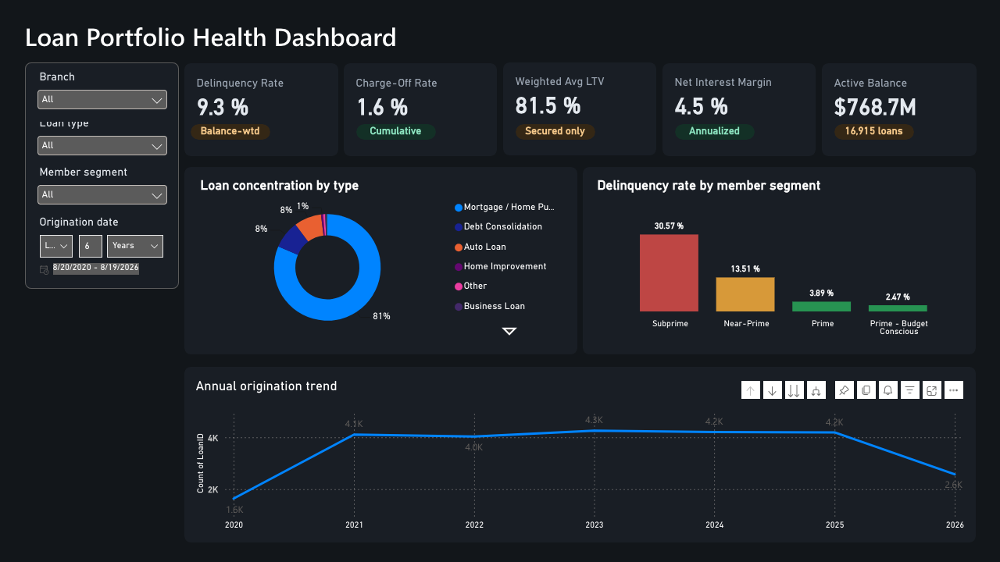
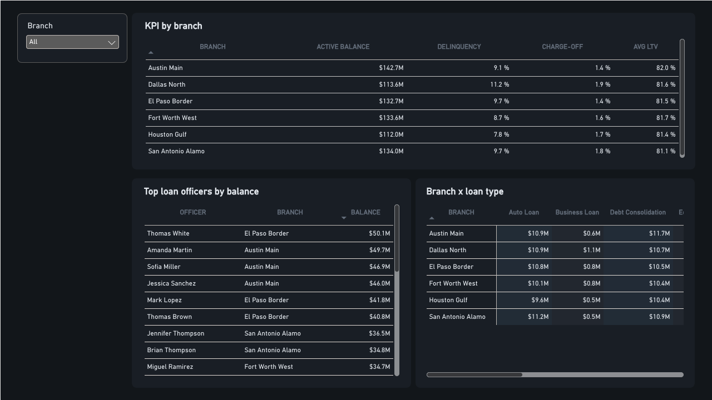

# Loan Portfolio Health Dashboard

<p align="left">
  
  
  
  
</p>

A SQL Server + Power BI portfolio project analyzing loan/member risk for a fictional credit union, built as a Data Specialist application portfolio piece.

## Business Problem

Credit unions need continuous visibility into loan portfolio health: how much of the book is delinquent, how much has been charged off as a loss, how exposed the institution is on secured lending (loan-to-value), whether the spread between loan income and cost of funds (net interest margin) is healthy, and whether the portfolio is dangerously concentrated in one loan type. This project builds a SQL Server data model and KPI layer that answers those five questions — and breaks each one down by branch, loan officer, and member risk segment so the results are actionable, not just descriptive.

Full write-up of the reasoning behind every decision: **[docs/study-guide.md](docs/study-guide.md)**.

## Tech Stack

- **SQL Server 2022** (Docker container, `mcr.microsoft.com/mssql/server`)
- **T-SQL**: normalized star schema, views, parameterized stored procedures, window functions
- **Python** (pandas/numpy): data cleaning and synthetic data generation pipeline
- **Power BI Service**: two-page interactive dashboard, 10 DAX measures, slicers, conditional-formatting heatmap (built via a static Excel/OneDrive data connection rather than a live SQL link — see [docs/study-guide.md, Section 5](docs/study-guide.md#5-power-bi-dashboard-steps) for why and how)
- **Data source**: [Kaggle "Bank Loan Status Dataset"](https://www.kaggle.com/datasets/zaurbegiev/my-dataset) (real credit score/income/loan-outcome data) blended with a synthesized credit-union operational layer (branch, loan officer, interest rate, collateral/LTV) — see [docs/study-guide.md, Section 2](docs/study-guide.md#2-environment--docker-setup) for exactly what's real vs. synthesized and why.

## Key Findings

- Portfolio delinquency rate (balance-weighted): **9.35%**
- Charge-off rate (cumulative, by amount): **1.63%**
- Weighted average LTV (secured loans): **~82%**
- Net interest margin: **~4.5%**
- Loan concentration by type is the most interesting finding: **mortgages are only 12% of loan *count* but 81% of active *dollar balance*** — a concentration risk that a simple count-based breakdown would completely miss, and a good example of why weighting matters for portfolio risk metrics.
- Delinquency rate varies sharply by member risk segment: **~3.9% for Prime members vs. ~30.6% for Subprime** — risk concentrates exactly where you'd expect, and the dashboard makes that pattern visible at a glance instead of buried in an average.

## Project Structure

```
loan-portfolio-health-dashboard/
├── docker-compose.yml       # SQL Server 2022 container
├── scripts/
│   ├── download_data.sh     # pulls the raw Kaggle dataset
│   ├── build_dataset.py     # cleans real data + generates synthetic fields -> data/processed/
│   └── run_sql.sh           # runs sql/*.sql against the running container, in order
├── sql/
│   ├── 01_schema.sql        # tables, keys, constraints
│   ├── 02_load_data.sql     # BULK INSERT from data/processed/
│   ├── 03_kpi_views.sql     # the 5 KPIs as views
│   ├── 04_stored_procedures.sql   # parameterized KPI summary + breakdown procs
│   └── 05_dashboard_queries.sql   # pre-aggregated queries for Power BI
├── data/                    # not committed (see .gitignore) — regenerate via scripts/
└── docs/
    └── study-guide.md       # full teaching-style walkthrough
```

## Quick Start

```bash
brew install colima docker && colima start
cp .env.example .env   # set MSSQL_SA_PASSWORD
docker compose up -d
./scripts/download_data.sh && python3 scripts/build_dataset.py
./scripts/run_sql.sh
```

Full setup walkthrough, including Kaggle API credential setup: [docs/study-guide.md, Section 2](docs/study-guide.md).

## Power BI Dashboard

Full build guide — visuals, DAX measures, and the real bugs hit along the way — in [docs/study-guide.md, Section 5](docs/study-guide.md#5-power-bi-dashboard-steps).

**Page 1 — Portfolio overview**



**Page 2 — Branch & officer detail**



- **Published report link:** _add here_

## License / Data Attribution

Source dataset: Kaggle, [`zaurbegiev/my-dataset`](https://www.kaggle.com/datasets/zaurbegiev/my-dataset) (license listed as unknown on Kaggle — raw/processed data is not redistributed in this repo; `scripts/build_dataset.py` regenerates it deterministically from your own Kaggle download).
